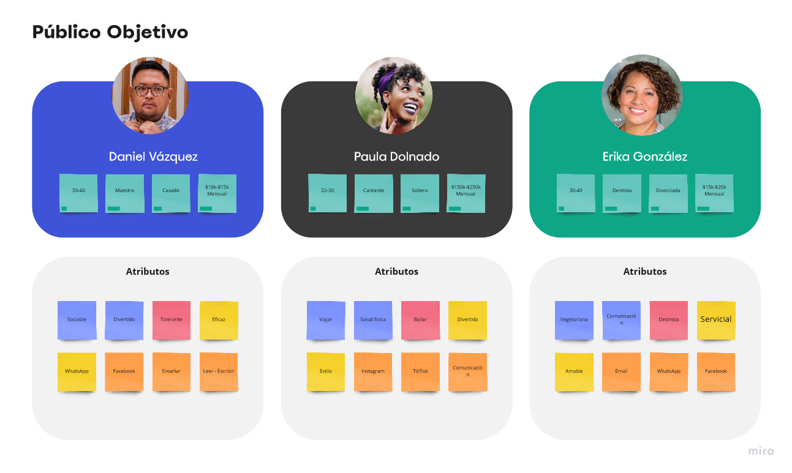

# MissionFrontEndPractica1

## Descripción de la práctica

Un despacho de abogados requiere una pagina web para la automatización de las demandas de sus clientes a traves de formularios, asi como tambien la automatización de los pagos y pueda darle seguimiento a su demanda.

## 1.- Toma de Requerimientos.

***ADMINISTRADOR***

* Cración de cuenta de abogado.
* Iniciar sesión.
* Recibe notificación de nueva demanda.
* Se genera automaticamente el documento legal con la información registrada en el formulariuo, en formato word para empezar el proceso.
* Recibe notificacion de pago de la demanda.
* Visualizacion del Dashboard de los ingresos recibidos.
* Actualizar el proceso de la demanda.
* Agregar comentarios en cada paso del proceso de la demanda.

***USUARIO***

* Creación de cuenta de cliente.
* Iniciar sesión.
* Formulario para la solicitud de nueva demanda.
* Proceso de pago para la demanda.
* Visualización del seguimiento de cada una de las actulizaciones del proceso legal.
* Recibir notificaciones sobre el avance del proceso.
* Visualización de comentarios en cada paso del proceso.

***SITIO***

* Debe ser responsivo.
* Colores a utilizar: Azul y Blanco (se aceptan propuestas).

### Diagrama de Flujo del sitio.

Diagrama de flujo sobre la funcionalidad que tendra el sitio web visto desde el cliente y el administrador.

### 1.1.- Buyer Persona

Se define el cliente ideal para la compra del sitio web.

## Público Objetivo

Es el publico que son usuarios potenciales para el uso del sitio web

